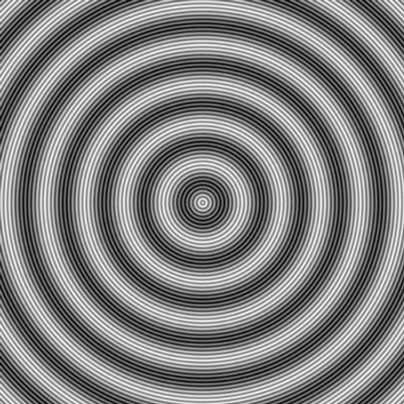
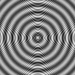

# Question 1
Nous avons une période de 10 pixels par cycle, donc la fréquence est égale à $f_{1} = \frac{1}{10} = 0.10 \text{ cycle/pixel}$.

# Question 2
Nous avons une période de 100 pixels par cycle, donc la fréquence est égale à $f_{2} = \frac{1}{100} = 0.010 \text{ cycle/pixel}$.

# Question 3
En plaçant son curseur sur la raie secondaire (qui correspond au cercle brillant au centre de l'image), $\rho$ permet de retrouver la période de l'image.

# Question 4
L'image **1024_moire** a été obtenue en ajoutant l'image **1024_moire_f2** à **1024_moire_f1**.
Par conséquent, la transformée de Fourier de l'image **1024_moire** correspond à la superposition des deux autres images.

# Question 5
On a ici utilisé un facteur 2 pour l’abscisse et l’ordonnée, on a donc :
$$
f_{ech} = \frac{1}{2} = 0.5 \text{ cycle/pixel},
\frac{f_{ech}}{2} = \frac{1}{2 \times 2} = \frac{1}{4} = 0.25 \text{ cycle/pixel}
$$
Étant donné que la fréquence maximale du motif est de $f_{max} = 0.10 \text{ cycle/pixel}$, on a alors $0.10 < 0.25$ donc l’inégalité $f_{max} \leq \frac{f_{ech}}{2}$ est bien vérifiée. L’échantillonnage **respecte** donc le théorème de Shannon.

Concernant les deux fréquences $f_{1}$ et $f_{2}$, leurs périodes ont été divisées par 2 (on a $p_{1} = 5 \text{ cycle/pixel}$ et $p_{2} = 50 \text{ cycle/pixel}$), par conséquent leurs fréquences ont été multipliées par 2. On a alors :
$$
f_{1} = 0.020 \text{ cycle/pixel},
f_{2} = \frac{1}{50} = 0.020 \text{ cycle/pixel}
$$

# Question 6
On a ici utilisé un facteur 8 pour l’abscisse et l’ordonnée, on a donc :
$$
f_{ech} = \frac{1}{8} = 0.125 \text{ cycle/pixel},
\frac{f_{ech}}{2} = \frac{1}{8 \times 2} = \frac{1}{16} = 0.0625 \text{ cycle/pixel}
$$
Et pour rappel :
$$
f_{1} = \frac{1}{10},
f_{2} =\frac{1}{100}
$$
Or, $\frac{1}{10} > \frac{1}{16}$. L’inégalité $f_{1} \leq \frac{f_{ech}}{2}$ n’est pas vérifiée, et $f_{1}$ **ne respecte pas** le théorème de Shannon.
Il s’agit donc de la fréquence $f_{2}$ qui évite le phénomène de repliement de spectre.

